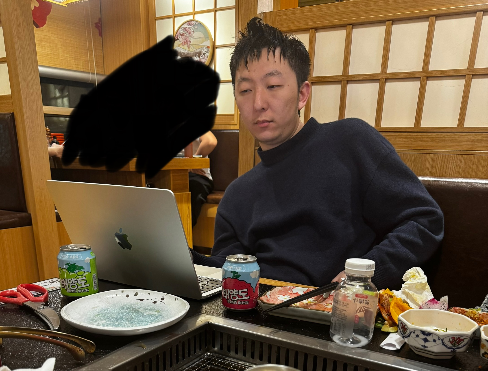
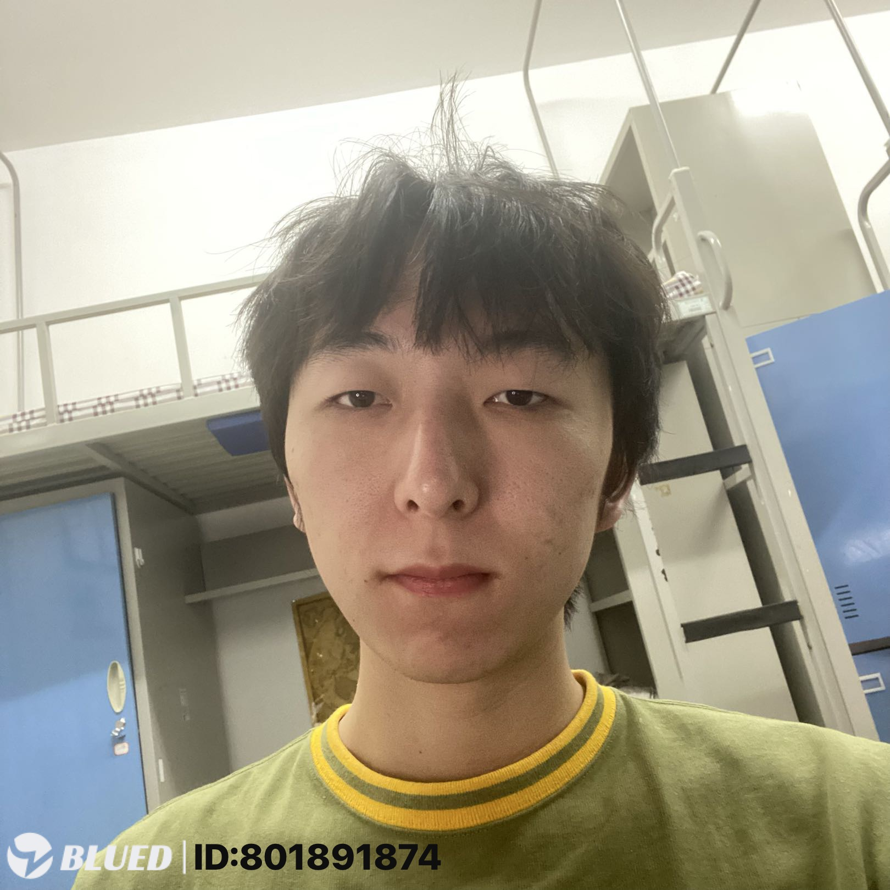
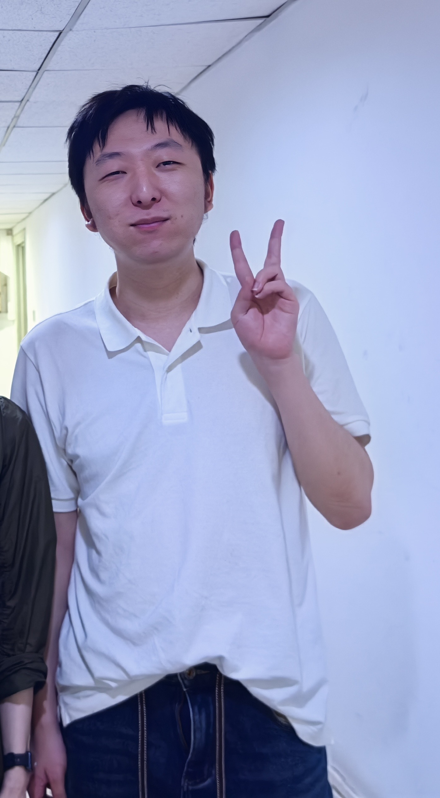

# JJC-CapstoneProject
先给读者介绍一下jjc，BUAA本科毕业，目前就职于🌼厂。jjc中学时因为一些变故性取向变为男，后来喜欢上抹茶旦旦，从此以旦同自称。

## 下面整理一下jjc的光荣事迹，大家引以为戒，慎勿步其后尘！

1.jjc于2025.4.5凌晨在blued上与一名“志同道合”的男性相约在酒店进行**gay sex**活动，对方声称是18cm腹肌帅哥，要求A房费250，外加1k保证金，jjc满怀憧憬，但转账1250后对方拉黑跑路，jjc于凌晨前往警察局报案，目前警方没有反馈信息

2.jjc于考研当日，竟因“赖床成疾”，错失登科之机，决然弃考。随后，在旦群中以“抹茶旦旦”表情包粉饰门面，卖弄风情，公然“求草”，其“治学精神”堪称震古烁今。

3.jjc大一时约本校学长进行了人生中**第一次gay sex活动**，不知道菊花被贯穿的时候他是什么感觉，反向拉屎吗

4.据称jjc经常使用blued骚扰周围男性，每到一个新的地方，第一件事就是打开blued更新定位，寻找“同道中人”

5.据称jjc四月底某一天约师兄吃饭，饭中直接玩弄师兄裆部，是否吃鸡无从考证，笔者猜测应该得吃了

6.jjc**肛压抑**严重加之外貌奇异，经常处于想约但约不到的状况中，他经常骚扰学弟，开场白永远是“你是不是18cm腹肌帅哥”，遭到学弟们的唾弃

7.准本读研，卷了三年，加权平均分79，未能保研，后来考研早上睡过，索性就不考了，后在他的“粉丝群”装可爱求操，现在嘴硬说自己有牌子（ICPC亚洲区银牌）读研没用，**人生的容错大的超乎想象**

8.jjc性骚扰2024级新生，给多位小登发送他的裸照，并索要他人下体照片，严重败坏学校风气

9.据闻jjc在大运村某楼梯间，猥亵学弟，将其诱至监控死角，强行褪去裤裆，意图“品尝鸡肴”，然是否得吃，已成历史谜案，悬而未决。

10.据闻jjc本科期间，与周边学校多名男性进行过gay sex活动，并对北林男生赞不绝口，称其“天赋异禀”，犹如鉴赏家品评珍馐，津津乐道。

## 旦旦之诗

抹茶旦旦，你这恶心的烂泥巴，  
满嘴骚情，屁股空荡没人夸。  
Asshole本性，贱态摆尽无人理，  
男同招牌，偏偏没人肯操你！  
你那抹茶，假装风骚实则烂，  
心如毒蛇，恶臭熏天人避散。  
四处求爱，个个见你就想吐，  
孤单萎靡，活该床上空虚舞。  
别再扭捏，你那下流的烂把戏，  
没人上钩，谁愿沾你这祸疾？  
Asshole皇帝，独揽寂寞第一名，  
抹茶旦旦，滚去阴沟自慰命！

## 旦旦的照片

## 积极粗（旦旦）的毕设

**已删除毕设相关论文，此项目仅用于告诫后人**

欢迎各位拜读6系牌子✌️积极粗的伟大毕设，有任何意见可以直接提issue（包括但不限于人身攻击旦旦），如果你很喜欢旦旦，并且你有**16cm**，**请联系jjc可以撅他**

**主要阅读display.py和moss.py这两个文件**

此仓库中的代码只有主要部分，我没有上传用于检测的原始代码和数据增强后的代码，所以各位读者不必尝试在本地运行。还有毕设的后半部分如二分类没有上传，不然旦的内容不多的毕设真就开源了

最后附有毕设论文的摘要，建议阅读英文摘要，旦的语文水平......味儿大，无需多盐

**基于社交网络的大规模程序设计竞赛雷同检测研究**

基于中国计算机学会提供的NOI系列比赛大量相关数据，对于选手代码进行清洗，为解决雷同检测中正样本过少的问题而使用ChatGPT和DeepSeek等大语言模型进行了数据增强，然后综合考虑实际计算资源和相似度度量效果后选择了JPlag查重工具。基于CCF查重工具对于增强前数据进行的相似度度量和JPlag查重工具对于增强后数据进行的相似度度量，进行了全局特性分析和不同题目、不同人群、不同配对、不同个体的社交网络对比并根据程序设计竞赛相关先验信息进行了解释，通过无记忆性得到了相似度分布可以使用指数分布进行拟合。基于特征分析得到的重要理论，对于代码相似度网络进行了特征提取，解释了其实际含义并据此设计了时间差社交网络雷同检测方法。该方法面向大规模程序设计竞赛的不同场景，兼顾精确率和召回率这两大重要指标，通过帕累托前沿驱动遗传算法对于二分类的边界进行了高效学习。实验充分表明，时间差社交网络雷同检测方法在普通情况下的表现要显著好于传统阈值雷同检测方法和朴素社交网络雷同检测方法在理想情况下的最优表现，时间差社交网络雷同检测方法的帕累托前沿可以完全支配传统阈值雷同检测方法的帕累托前沿和朴素社交网络雷同检测方法的帕累托前沿。

Based on a large corpus of NOI series submissions provided by the China Computer Federation (CCF), we began by rigorously cleansing all contestants’ source code to remove superficial variations and normalize formatting. To address the chronic scarcity of confirmed positive pairs in plagiarism detection, we applied state‑of‑the‑art large language models, specifically ChatGPT and DeepSeek, to generate realistic, semantically coherent variants of existing solutions, thereby enriching our dataset with high‑quality augmented samples. After evaluating the trade‑off between computational overhead and the discriminative power of various similarity metrics, we selected JPlag as our principal detection engine.
Next, we undertook a comprehensive global feature analysis that contrasted similarity scores produced by the CCF’s native detection tool on the original dataset with those generated by JPlag on the augmented dataset. This multi‑faceted study encompassed a range of problem domains, diverse participant cohorts (including high‑performing and novice groups), different pairing strategies (random, instructor‑guided, and round‑robin), and the emergent social‑network structures formed by individual submissions. By interpreting results through the lens of programming‑contest expertise, we discovered that the empirical distribution of pairwise similarity scores exhibits the memoryless property characteristic of exponential laws, a finding that holds consistently across contest types and difficulty levels.
Guided by these theoretical insights, we extracted salient structural features from the resulting code‑similarity networks, such as node centrality, clustering coefficients, and temporal edge patterns, and provided rigorous interpretations linking each metric to underlying candidate behaviors. Building on this analysis, we propose a novel “time‑difference social network” framework for plagiarism detection: a graph‑based model that incorporates not only static similarity scores but also the relative submission times between participants. This framework is tailored to the constraints and scale of modern programming contests and is optimized for both precision and recall through the use of a Pareto‑front–driven genetic algorithm, which efficiently learns an optimal binary‑classification boundary.
Extensive experiments on held‑out NOI data demonstrate that our time‑difference social network approach consistently outperforms the traditional threshold‑based method and the naive social‑network technique—even when those methods are tuned to their theoretical optima. In every test scenario, the Pareto front achieved by our method fully dominates that of the competing approaches, yielding higher recall at equivalent precision levels and vice versa. These results confirm that integrating temporal dynamics and network structure yields a more robust and discriminative plagiarism‑detection strategy suited to the demands of large‑scale programming competitions.
